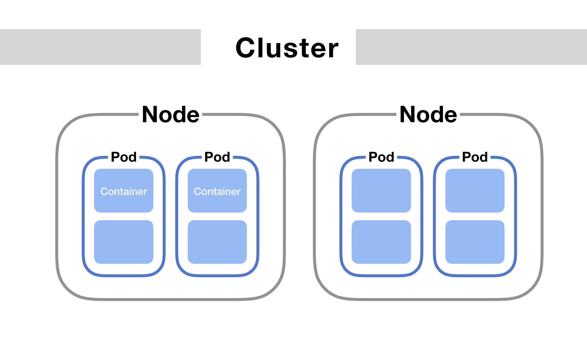

#Pod-definition-yaml && replicatset 
<!--  -->
----------------------------------------------------------------------

----------------------------------------------------------------------
**Create a pod using file yaml:** 
<!--  -->
*what's a pod ?* 
<!-- | -->
**Pods are the smallest deployable units you can create and manage in Kubernetes. A pod is a group of one (or more) containers, utilizing shared network and storage resources. By nature, the contents of a pod are always co-scheduled and co-located, and they are run in a shared context.**
------------------------------------------------------------------------
 <!--  -->
create a pod with command use a file yaml :  
<!--  -->

*kubectl run nginx --image=nginx --dry-run=client -o yaml > nginx-definition.yaml 
<!--  -->
 // Create a file yaml && the file contains all composant to create a pod nginx
 <!--  -->
*kubectl create -f nginx-definition-yaml
 <!--  -->
// Create a pod by filename  
<!--  -->
*kubectl replace -f replicaset.yaml 
<!--  -->
*kubectl scale --replicas=6 -f replicaset.yaml

